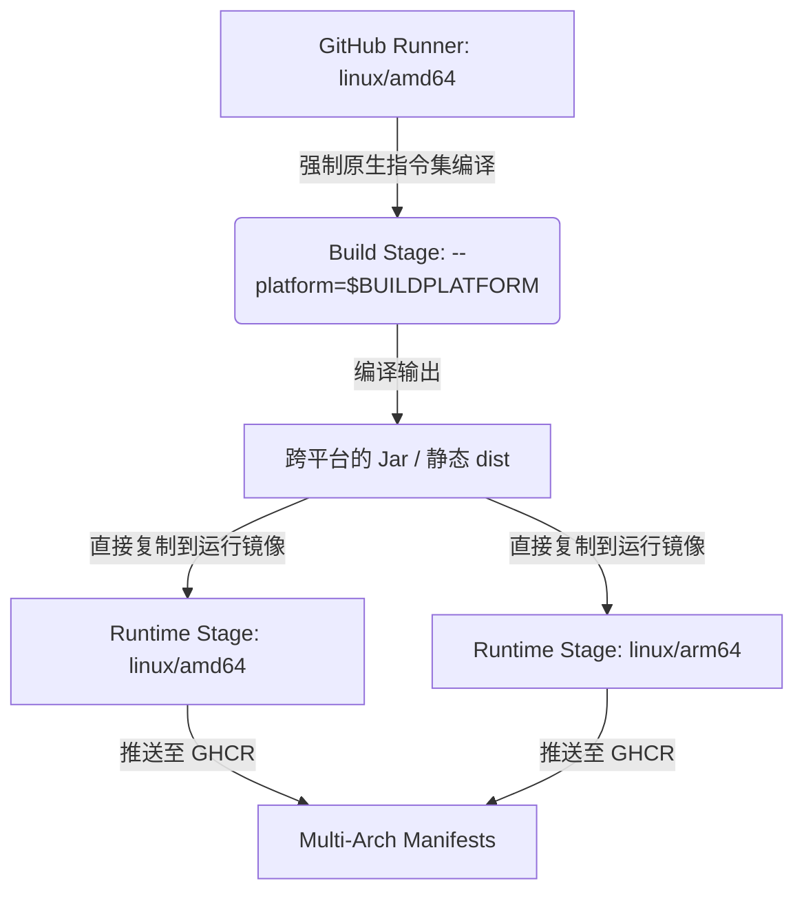

# 开发日志：适配生产环境 Docker 容器至 Arm 64 架构

## 1. 背景与改造目标

随着 Arm 64 硬件架构（如 AWS Graviton 处理器、阿里云 Arm 实例，以及 Apple Silicon M 系列芯片等）在生产和本地开发环境的普及，将 Jasmine 微服务项目适配为支持 Arm 64 架构运行成为迫切需求。

本阶段的改造目标为：
- 适配 Jasmine 全套微服务容器镜像（包含 5 个后端服务、1 个网关、1 个 Schema 服务及前端容器），使其支持在 `linux/amd64` 和 `linux/arm64` 双架构下顺畅运行。
- 修改 GitHub Actions 自动化工作流，使其在触发构建时能自动打包并推送多架构的镜像（Multi-arch manifests）至 GHCR。
- **核心架构考量**：在极大地保障镜像可移植性的同时，**决不能**破坏原 CI 流程的构建速度，必须规避 x86_64 宿主机通过 QEMU 模拟 Arm 运行造成的构建性能雪崩（编译速度下降达 5~10 倍）。

---

## 2. 架构设计决策：基于 BuildKit 交叉编译的性能提升

传统的 Docker Buildx 多架构构建过程会拉取对应的目标架构基础镜像。如果在宿主机为 `linux/amd64` 的 GitHub Runner 上直接构建 `linux/arm64` 镜像，Docker 会使用 QEMU 进行指令级模拟运行。
对于 Java（Maven 依赖解析与代码编译）和前端（Node/Bun 依赖安装与打包）而言，在 QEMU 下执行编译的 CPU 额外开销巨大，通常会导致一次构建耗时从 3-5 分钟飙升至 30 分钟以上，甚至导致内存溢出而挂掉。

### 优化方案：分离编译期与运行期架构
由于 Java 编译产生的 `.jar` 字节码文件，以及 Vite 构建出的前端 `dist/` 静态网页资源，本质上都是**平台无关**的（Platform-independent）。
因此，我们做出了如下的优雅架构设计：



1. **后端 Dockerfile 交叉编译**:
   - 在 Stage 1 (builder) 编译期镜像上使用 `--platform=$BUILDPLATFORM` 参数：
     ```dockerfile
     FROM --platform=$BUILDPLATFORM eclipse-temurin:21-jdk AS builder
     ```
     这保证了 Maven 始终在本机（x86_64）高速并行编译。
   - 在 Stage 2 (runtime) 镜像上使用默认的目标平台：
     ```dockerfile
     FROM eclipse-temurin:21-jre
     ```
     Docker Buildx 会在生成 AMD64 镜像时拉取 `amd64` 的 JRE，在生成 ARM64 镜像时拉取 `arm64` 的 JRE。编译产物 `app.jar` 被无损复制进去。最终在两个平台下都能运行在原生的 JVM 容器中。

2. **前端 Dockerfile 交叉编译**:
   - 在 Stage 1 (build-stage) 编译期镜像上同样使用 `--platform=$BUILDPLATFORM`：
     ```dockerfile
     FROM --platform=$BUILDPLATFORM oven/bun:1.3.12 AS build-stage
     ```
     使 `bun install` 与 `bun run build` 依旧以宿主机原生速度运行。
   - 在 Stage 2 (production-stage) 镜像上保持原样：
     ```dockerfile
     FROM nginx:stable-alpine
     ```
     这样在打包多平台时，直接拉取对应平台的原生轻量化 Nginx 镜像并拷入静态网页资源即可。

---

## 3. 具体修改细节

### 3.1 根目录后端 `Dockerfile`
修改内容：
```diff
-# ---- Stage 1: Maven build for one module ----
-FROM eclipse-temurin:21-jdk AS builder
+# ---- Stage 1: Maven build for one module (Always runs on the build host platform for maximum speed) ----
+FROM --platform=$BUILDPLATFORM eclipse-temurin:21-jdk AS builder
```

### 3.2 前端 `web/Dockerfile`
修改内容：
```diff
+# syntax=docker/dockerfile:1
-FROM oven/bun:1.3.12 AS build-stage
+FROM --platform=$BUILDPLATFORM oven/bun:1.3.12 AS build-stage
```

### 3.3 GitHub 工作流 `.github/workflows/docker-publish.yml`
- **引入平台打包选项**：为 `build-backend` 和 `build-frontend` 任务下的 `docker/build-push-action@v6` 步骤分别添加 `platforms: linux/amd64,linux/arm64` 参数。
- **引入 QEMU 适配器**：在前端任务的 `setup-buildx-action` 前加上 `uses: docker/setup-qemu-action@v3` 作为多平台基础组件支持，增强工作流的扩展性与健壮性。

---

## 4. 验证与运维建议

### 4.1 GitHub Actions 自动打包
每当推送代码到 `main`、`microservices` 分支，或发布带有 `v*` 的版本 Tag 时，GitHub Actions 会启动自动打包。
你可以在 Github 仓库的 Actions 历史以及 GHCR (GitHub Container Registry) 页面中查看每个镜像包的信息。你会看到每个镜像包下多出了两个 OS/Arch 架构：
- `linux/amd64`
- `linux/arm64`

### 4.2 本地运行与部署
对于使用 Apple Silicon (M1/M2/M3) 等 Arm64 处理器的开发人员或轻量级服务器：
1. 拉取和部署时无需做任何额外配置，Docker 会根据当前所在的物理平台自动拉取与之匹配的 Arm64 镜像（或 AMD64 镜像）。
2. 在 Compose 中直接像以前一样使用 `docker compose up -d` 即可。

### 4.3 堆内存（CompressedOops）与 GC 调优
- **ZGC 支持**：Java 21 已经对 ARM64 架构的 ZGC 提供了全面原生支持，因此在 Dockerfile 中保留的 `-XX:+UseZGC` 参数在 Arm 64 环境下能够正常并高效运行。
- **压缩对象指针（CompressedOops）**：生产环境 Dockerfile 中指定的 `-XX:+UseCompressedOops` 在 ARM64 架构下当堆大小小于 32GB 时同样会被支持并优化内存占用，配置十分健康稳妥。
