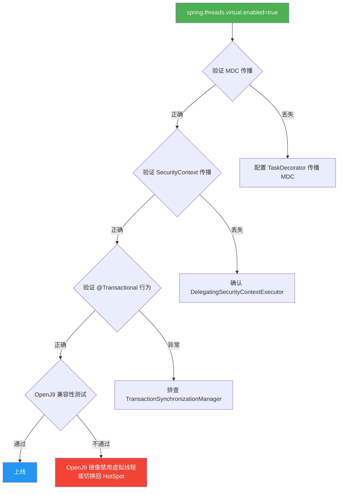

# 虚拟线程引入可行性分析

> 分析日期：2026-04-29  
> 分析背景：JDK 21 已引入虚拟线程（Virtual Threads），评估项目是否适合启用以提升高并发能力。

---

## 一、项目当前技术画像

| 维度 | 现状 |
|------|------|
| JDK 版本 | 21 (已满足虚拟线程前提) |
| Spring Boot 版本 | 3.5.13 (一行配置即可开启) |
| Web 容器 | Tomcat (Servlet 阻塞模型) |
| 数据库访问 | MyBatis-Plus (同步 JDBC + HikariCP) |
| 缓存 | Spring Data Redis / Lettuce (同步包装) |
| 消息队列 | Spring AMQP / RabbitMQ (同步发送 + 监听器) |
| 并发原语 | **零** — 没有 `synchronized`、`ReentrantLock`、`@Async`、`CompletableFuture` |
| 业务特点 | 花店管理系统，内部员工使用，并发量极低 |
| 容器内存 | 512MB 限制 |

---

## 二、技术上能不能引入？— 能，成本极低

开启虚拟线程只需一行配置：

```yaml
spring:
  threads:
    virtual:
      enabled: true
```

这会让 Spring Boot 自动将 Tomcat 请求处理线程、`@Scheduled` 任务线程、`@Async` 线程池全部替换为虚拟线程。

**项目的代码对虚拟线程非常友好：**

1. **没有 `synchronized` 块** — 虚拟线程最大的坑是 pinning（钉扎），即虚拟线程进入 `synchronized` 块后无法卸载，会固定在载体线程上。项目代码中搜索结果为零，库存并发使用的是 CAS SQL（`compareAndSetStock`），而非 Java 层锁。

2. **没有显式线程池** — 没有 `ExecutorService`、`ThreadPoolTaskExecutor` 等自定义线程池，不存在迁移复杂度。

3. **全链路阻塞 I/O** — 每个 HTTP 请求都会经历：JDBC 查询 → Redis 读写 → MQ 发送，全都是阻塞操作。这正是虚拟线程最擅长优化的场景（阻塞时自动让出载体线程）。

---

## 三、应不应该引入？— 结论：当前不建议，投入产出比很低

### 核心原因：系统的真正瓶颈不在 Tomcat 线程数

```
请求并发增长时的瓶颈演进路径：

Tomcat 200线程 ──→ HikariCP 连接池(默认10) ──→ MySQL 单实例
       ↑                    ↑                        ↑
   不太可能先满         这里先满                  这里最先满
```

当前项目 Tomcat 默认 200 线程，HikariCP 默认 10 个连接。假设每个请求平均消耗一个数据库连接，**200 个并发请求中只有 10 个能同时执行 SQL，其余 190 个都在等连接**。虚拟线程让 Tomcat 能同时处理 10000 个请求，但数据库连接池仍然只有 10 个，99% 的虚拟线程都在等连接 — 这不是"高并发"，这是"排队"。

### 具体问题拆解

#### 1. 业务场景决定了不需要高并发

这是一个花店内部管理系统（预约、销售、库存、会员），典型场景是 3-5 个店员同时操作。Tomcat 默认 200 线程远远超过实际需求，线程池从来不会成为瓶颈。

#### 2. 512MB 内存限制下，虚拟线程反而增加开销

虚拟线程本身的栈帧虽然比平台线程轻（几 KB vs 1MB），但运行时还需要：

- ForkJoinPool 载体线程（默认 = CPU 核心数）
- 每个虚拟线程的 continuation 对象和栈帧
- I/O 操作时的临时缓冲区

在 512MB 限制下，这些开销虽然不大，但带来的收益几乎为零。

#### 3. OpenJ9 对虚拟线程的支持仍为实验性质

项目同时部署 HotSpot 和 OpenJ9 两种镜像。OpenJ9 对虚拟线程的支持状态：

- 从 JDK 21 起提供**实验性支持**，不是生产就绪
- I/O 操作的卸载行为可能不如 HotSpot 完善
- 监控与诊断工具支持不完整
- 高并发场景下调度器可能存在可扩展性问题

这意味着如果启用虚拟线程，OpenJ9 镜像可能需要回退到平台线程，增加了运维复杂度。

#### 4. ThreadLocal 传播需要额外处理

项目中有两处关键的 `ThreadLocal` 依赖：

| 位置 | 用途 | 虚拟线程风险 |
|------|------|-------------|
| `RequestTraceFilter` 中的 `MDC.put()` | traceId / requestId 日志链路 | 虚拟线程卸载/重新挂载时 MDC 可能丢失 |
| `SecurityContextHolder` | JWT 认证上下文 | Spring Security 6.x 已适配，但需验证 |

Spring Boot 3.5 对 `@Transactional` 的 `ThreadLocal` 传播已做了适配，但 **MDC 不在 Spring 的自动传播范围内**，需要额外配置 `TaskDecorator` 或使用 Micrometer Tracing。

---

## 四、什么时候应该引入？

如果未来项目发展到以下场景，虚拟线程就变得有价值：

| 场景 | 为什么虚拟线程有帮助 |
|------|---------------------|
| **对外开放 API**，QPS 突破 500+ | Tomcat 200 线程可能不够，虚拟线程可弹性扩容 |
| **大量慢查询/外部 HTTP 调用** | 阻塞时间长，线程利用率低，虚拟线程可减少等待浪费 |
| **需要 SSE/长轮询** | 每个连接长期占用线程，虚拟线程避免线程耗尽 |
| **数据库连接池调大到 50+** | 此时 Tomcat 线程数才可能成为瓶颈，虚拟线程才有意义 |

---

## 五、如果一定要引入，需要做什么？



### 最小改动清单

1. `application.yml` 加一行 `spring.threads.virtual.enabled: true`
2. HikariCP 连接池需调整：`spring.datasource.hikari.maximum-pool-size` 适当增大（否则虚拟线程都在等连接）
3. MDC 传播：自定义 `TaskDecorator` 或引入 Micrometer Tracing
4. OpenJ9 镜像：需要单独测试虚拟线程兼容性，可能需要加 `-XX:+EnableVirtualThreads` JVM 参数
5. 压测验证：确认在 512MB 内存下的表现

---

## 六、最终结论

| 评估维度 | 评分 | 说明 |
|----------|------|------|
| 技术可行性 | ★★★★☆ | 代码非常友好，一行配置可开启，但 OpenJ9 支持存疑 |
| 实际收益 | ★☆☆☆☆ | 业务并发量极低，线程池不是瓶颈，数据库才是 |
| 引入成本 | ★★☆☆☆ | 配置简单，但 MDC/OpenJ9 需额外处理 |
| 风险 | ★★★☆☆ | OpenJ9 实验性支持 + MDC 丢失 + 内存压力 |

**建议：暂不引入。** 当前系统的并发瓶颈在数据库和连接池，不在 Tomcat 线程数。如果未来业务规模增长（对外开放 API、QPS 大幅上升），再考虑启用虚拟线程，届时只需要一行配置 + MDC 传播适配即可。优先级更高的是**数据库查询优化**（如 `buildAppointmentVOs` 中的多次查询可以合并）和**连接池调优**。
